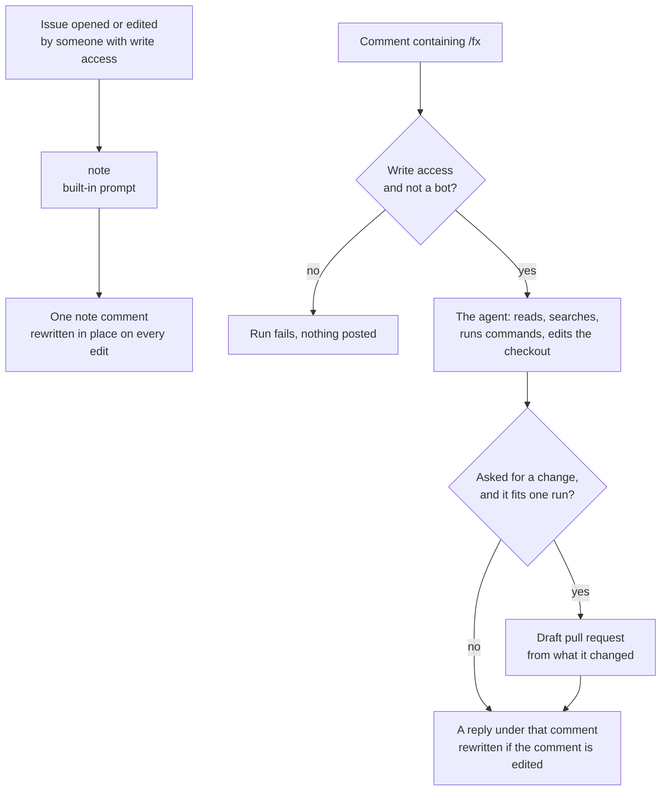

# fx agent action

[](https://github.com/khalido/fx-agent-action/actions/workflows/check.yml)

An agent on your issues. Open one and [fx](https://fx.sh), Vercel Labs'
coding agent, reads the code and leaves a note: where this lives, what is
already there, and the answer itself when the issue turns out to be a
question. Comment `/fx` with a question and it answers; say "fix this" or
"add that" and it makes the change, runs your checks, and opens a draft pull
request when it judges it can do the job in one run, or leaves a note saying
what it would change and what a stronger agent should pick up. It runs in
your own runner, no app to install, no service in the middle. Each comment
gets its own reply, edited in place, so a thread reads as question and answer
pairs.

```yaml
# .github/workflows/fx.yml
name: fx
on:
  issues:
    types: [opened, edited]
  issue_comment:
    types: [created, edited]
jobs:
  fx:
    if: >-
      (github.event_name == 'issues' && github.event.issue.user.type != 'Bot' &&
       contains(fromJSON('["OWNER","MEMBER","COLLABORATOR"]'), github.event.issue.author_association))
      || (github.event_name == 'issue_comment' && (startsWith(github.event.comment.body, '/fx') || contains(github.event.comment.body, ' /fx')) &&
          github.event.comment.user.type != 'Bot' &&
          contains(fromJSON('["OWNER","MEMBER","COLLABORATOR"]'), github.event.comment.author_association))
    runs-on: ubuntu-latest
    timeout-minutes: 20
    concurrency:
      group: fx-${{ github.event_name }}-${{ github.event.issue.number }}
      cancel-in-progress: ${{ github.event_name == 'issues' }}
    permissions:
      contents: write
      pull-requests: write
      issues: write
    steps:
      - uses: actions/checkout@v7
        with:
          persist-credentials: false
          fetch-depth: 0
      - uses: khalido/fx-agent-action@main
        env:
          AI_GATEWAY_API_KEY: ${{ secrets.AI_GATEWAY_API_KEY }}
        with:
          max_steps: '60'
```

```bash
vercel ai-gateway api-keys create --name github-actions --limit 10 --refresh-period monthly
gh secret set AI_GATEWAY_API_KEY
gh api -X PUT repos/OWNER/REPO/actions/permissions/workflow \
  -f default_workflow_permissions=read -F can_approve_pull_request_reviews=true
```

That is the setup: an [AI Gateway](https://vercel.com/ai-gateway) key with
its own budget, made with the [Vercel CLI](https://vercel.com/docs/cli), the
secret, and the switch GitHub leaves off that lets a workflow open a pull
request. `gh secret set` prompts for the key, which keeps it out of your shell
history; a script or an agent doing this unattended passes `--body` or pipes it
in. The same file with comments is [`examples/fx.yml`](examples/fx.yml);
this repo runs it on itself. One job, one agent: a new issue gets a note,
a `/fx` comment gets whatever it asked for. Only want answers? Set
`contents: read` and `memory: false`: the agent may still try a change, but
the push fails and the comment says so instead of linking a PR. `mode: read`
takes the shell away too, at the cost of the tests it could have run.

## What happens



Edit the issue and the note refreshes. Edit your comment and its reply
refreshes. Nothing merges without a person.

## Talking to it

**`/fx why is the sync running twice?`** reads the repo, the thread and the
git history, tries things in the checkout and runs the tests, then answers.
The checkout is thrown away.

**`/fx add a retry to the API client`** makes the change, runs your checks,
and what changed becomes a branch and a draft PR linked from the comment. The
agent decides that: when the change is bigger than one run or needs a call
that is not its to make, it says what it would change and where, and what a
stronger agent or a person should pick up. There is no magic word; the
workflow's `permissions:` block is what decides whether it can push at all.

**Never want a pull request?** `mode: answer`. The agent keeps its shell, so
it still runs your tests and tries the fix before it answers, and the
checkout is thrown away every time. That is the setting for a repo where
`main` deploys on push and nothing should ever open a branch.

`/fx` can sit anywhere in the comment, any case, but not in a quoted line.
`trigger: '/fx, /agent'` accepts several phrases; widen the job's `if:` to
match. A slash and not a mention because `@fx` is a real person on GitHub.

## Changing what it says

The action already knows how to be an agent in a runner: where it is, which
tools it has, that nobody will answer it, how the answer is posted, how a PR
happens. The note it leaves on an issue is built in too,
[`prompts/issue.md`](prompts/issue.md), and when that prompt gets better here
it gets better in every repo on the next run. What a repo adds is about the
repo, and there are two doors.

**What your repo wants goes in [`AGENTS.md`](https://agents.md).** fx reads
it on every run, for every trigger, the same file your other agents read, and
the base block tells it that file may add to or adjust the task. So adding to the note is two lines
there: "when you leave a note on an issue, name the design doc that covers it;
anything that needs taste is KO's call". A short `## In CI` section keeps it
apart from laptop instructions like "run the app and click".

**Skills.** The action ships its own under [`skills/`](skills/): `open-pr`,
how a change ships (clean tree, checks run, one file with the title and
body), and `compare-models`, which checks a model's id and price on the
gateway, what people hit with it, and whether it fits this repo's jobs. They
are copied into fx's skill folder on the runner for that run only. Your repo's own skill
folders are seen as they are; `.github/fx/skills/` is copied the same way for
skills only this agent should have. `skills: false` turns the copy off.

**Memory.** On by default: the agent keeps one `MEMORY.md` on an
`agent-memory` branch: what earlier runs learned about this repo, read before
each run, edited by the agent with its ordinary tools, pushed back after the
run if it changed, and only from runs by people with write access; an allowed
stranger's run reads it and cannot change it. A model of the repo, not a
diary, and when it grows past `memory_lines` the action compacts it with one
cheap call. Read it on the
branch, edit it yourself, or delete the branch to forget. Needs
`contents: write` on the job for the push; fx never holds that token.

**A different note goes in `.github/fx/issue.md`.** When that file exists
the action uses it on issue events instead of the built-in note, no input
needed. Start from the built-in text. `prompt` or `prompt_file` on a job
replaces the instruction for every event that job handles, for a job that is
not the note. For `/fx` comments the prompt is the comment.

## Who can trigger a run

Two checks before anything else, the same two
[claude-code-action](https://github.com/anthropics/claude-code-action) runs,
and the run fails if either says no: write access to the repo on issue and PR
events, and a human actor on every event. `allowed_non_write_users` and
`allowed_bots` are the exceptions, and only combine with `mode: read`, which
has no shell and opens nothing. Keep the `if:` on the job too; it is what
stops a stranger's `/fx` from booting a runner at all.

## Inputs

All optional.

| Input | Default | |
|---|---|---|
| `prompt` | the comment, or the built-in note on an issue event | What to ask. The thread is appended below it. |
| `prompt_file` | | Instructions in a file in your repo. Wins over `prompt` and the built-in note when it exists. |
| `model` | `deepseek/deepseek-v4.1-flash` | Any [AI Gateway model id](https://vercel.com/ai-gateway/models). |
| `mode` | `agent` | What a run may do. `agent` ships: shell, edits, and a draft PR when it decides to. `answer` verifies: the same shell, nothing ever committed or opened. `read` only reads: no shell, no PR. |
| `memory` | `true` | One `MEMORY.md` on an orphan branch, read before and pushed after each run. Your default branch is never touched. |
| `memory_branch`, `memory_repo`, `memory_lines` | `agent-memory`, this repo, `80` | Where the memory lives and how long it may get. |
| `skills` | `true` | Copy the action's skills and the repo's `.github/fx/skills/` to fx on the runner. |
| `trigger` | `/fx` | Whole word, anywhere in the comment. Comma-separate several. |
| `allowed_non_write_users` | | Logins exempt from the write check, or `*`. |
| `allowed_bots` | | Bots allowed to trigger, with or without `[bot]`, or `*`. |
| `max_steps` | `30` | Cap on the tool loop. Set here, so a repo's `.fx.json` cannot raise it. |
| `effort` | fx's `auto` | Reasoning effort, `low` to `max`, on models that have it. |
| `provider_order` | the gateway's choice | Up to 8 gateway providers to try first, e.g. `deepseek, fireworks`. |
| `timeout_minutes` | `10` | Stop fx after this long, so an unreachable model still ends in a comment. Keep it under the job's `timeout-minutes`. |
| `max_cost` | `1` | Fail over this many dollars, after the fact. A PR the agent asked for still opens. |
| `post` | `comment` | `none` leaves the answer on the `response` output. |
| `comment_key` | | Keeps this job's comment apart from another fx job's. |
| `session_artifact` | `true` | The run as one HTML file on the run page. |
| `github_token` | the workflow's | An App token for a named bot and CI on its PRs; [guide](docs/guide.md#a-bot-with-its-own-name). |
| `include_thread`, `include_diff` | `true` | What the agent sees besides title and body. |
| ~~`shell`~~, ~~`pr_model`~~ | | Removed in 1.1.0. Passing either fails the run and names the replacement; `shell: true` + `mode: read` is now `mode: answer`. |
| `issue_number`, `branch_prefix`, `working_directory` | | See [`action.yml`](action.yml). |

Outputs: `response`, `cost`, `steps`, `session_id`, `comment_url`, `pr_url`.

## Examples

- **[fx](examples/fx.yml)**: the one above, with comments.
- **[pr-review](examples/pr-review.yml)**: a review on open and on push, under 200 words, no praise.
- **[triage](examples/triage.yml)**: labels from the ones the repo has. The agent picks, the workflow applies.
- **[build-it](examples/build-it.yml)**: comments only, on a stronger model.
- **[weekly-deps](examples/weekly-deps.yml)**: bump, run your checks, one PR a week with a note.
- **[minimal-no-action](examples/minimal-no-action.yml)**: fx in two `run:` lines, no action at all.

## When it goes wrong

Every run uploads the session as one HTML file, kept a week: every tool call,
its arguments, its result, including web searches with the date window they
used. Read that before guessing. The comment footer has the model, tokens, cost
in cents and a link to the run; a rewritten comment stacks its earlier runs and
a total.

## Before you turn it on

The thread goes to the model as evidence, with hidden markup stripped. The
workflow's `permissions:` block decides what the agent can do, not this action,
and branch protection is what makes "at most a draft PR" true. Since the agent
decides for itself when a request is worth shipping, more runs reach the push
than when a keyword was needed, so the trust boundary is everyone with write
access to the repo rather than everyone with write access who also typed the
word. On a private repo that is usually the point; on a public one, read the
actor checks below. The agent reads
your repo's `AGENTS.md` and sees every skill folder in it, the same ones your
laptop agent uses. Anyone who can trigger a run can spend the key, so give the
key its own budget. The [guide](docs/guide.md#before-you-turn-it-on) has the
full list, including what a private repo on the free plan, which cannot have
[branch protection](https://docs.github.com/en/repositories/configuring-branches-and-merges-in-your-repository/managing-protected-branches/about-protected-branches),
is trusting.

## Why fx

I tried the bigger agents in this seat first. claude-code-action and
opencode's action are good, and heavy: slow to start, an app or a service in
the middle, more than an issue note needs. shaftoe's pi action was closer,
and this one took its comment marker and its 👀, but pi wants extensions for
the basics, and every extension I picked up did a billion things when I
wanted one. I started building my own. Then fx: skills, MCP, web search and
fetch, sessions you can read afterwards, one binary, none of it in the way.
This action is the GitHub plumbing around it and nothing else.

## The rest

[docs/guide.md](docs/guide.md) is everything else in one file: the two
modes, the prompt layer by layer, the actor checks in detail, pull requests
and App tokens, cost, and what fails on the first day. For an agent, the raw
copy is
`https://raw.githubusercontent.com/khalido/fx-agent-action/main/docs/guide.md`.
[docs/prior-art.md](docs/prior-art.md) is what the other coding-agent actions
do and where this one differs. Working on the action itself?
[`AGENTS.md`](AGENTS.md), and fx's docs at
[fx.sh/llms.txt](https://fx.sh/llms.txt) first.

Apache-2.0, the same license as fx.
