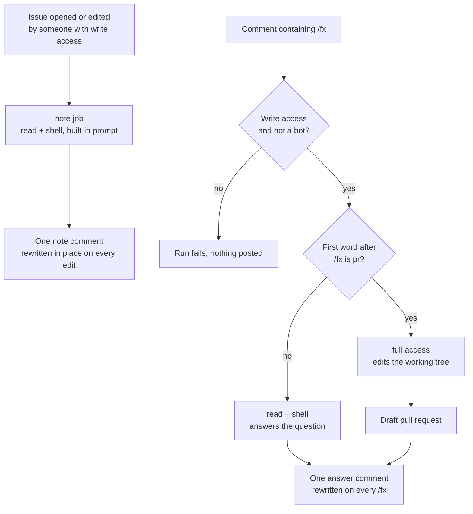

# fx agent action

[](https://github.com/khalido/fx-agent-action/actions/workflows/check.yml)

An agent on your issues. Open one and [fx](https://fx.sh), Vercel Labs'
coding agent, leaves a short note after reading the code. Comment `/fx` with a
question and it answers. `/fx pr …` gets a draft pull request. It runs in your
own runner, no app to install, no service in the middle, and posts one comment
that it edits rather than a new one per run.

```yaml
# .github/workflows/fx.yml
name: fx
on:
  issues:
    types: [opened, edited]
  issue_comment:
    types: [created]
jobs:
  note:
    if: >-
      github.event_name == 'issues' &&
      github.event.issue.user.type != 'Bot' &&
      contains(fromJSON('["OWNER","MEMBER","COLLABORATOR"]'), github.event.issue.author_association)
    runs-on: ubuntu-latest
    timeout-minutes: 10
    concurrency:
      group: fx-note-${{ github.event_name }}-${{ github.event.issue.number }}
      cancel-in-progress: true
    permissions:
      contents: write
      issues: write
    steps:
      - uses: actions/checkout@v7
        with:
          persist-credentials: false
          fetch-depth: 0
      - uses: khalido/fx-agent-action@main
        env:
          AI_GATEWAY_API_KEY: ${{ secrets.AI_GATEWAY_API_KEY }}
        with:
          mode: read
          shell: true
          comment_key: note
          memory: true
  comment:
    if: >-
      github.event_name == 'issue_comment' &&
      contains(github.event.comment.body, '/fx') &&
      github.event.comment.user.type != 'Bot' &&
      contains(fromJSON('["OWNER","MEMBER","COLLABORATOR"]'), github.event.comment.author_association)
    runs-on: ubuntu-latest
    timeout-minutes: 20
    concurrency:
      group: fx-comment-${{ github.event_name }}-${{ github.event.issue.number }}
      cancel-in-progress: false
    permissions:
      contents: write
      pull-requests: write
      issues: write
    steps:
      - uses: actions/checkout@v7
        with:
          persist-credentials: false
          fetch-depth: 0
      - uses: khalido/fx-agent-action@main
        env:
          AI_GATEWAY_API_KEY: ${{ secrets.AI_GATEWAY_API_KEY }}
        with:
          shell: true
          max_steps: '60'
          memory: true
```

```bash
vercel ai-gateway api-keys create --name github-actions --limit 10 --refresh-period monthly
gh secret set AI_GATEWAY_API_KEY
gh api -X PUT repos/OWNER/REPO/actions/permissions/workflow \
  -f default_workflow_permissions=read -F can_approve_pull_request_reviews=true
```

That is the setup: an [AI Gateway](https://vercel.com/ai-gateway) key with
its own budget, made with the [Vercel CLI](https://vercel.com/docs/cli), the
secret, and the switch GitHub leaves off that lets a workflow open a pull
request. The same file with comments is [`examples/fx.yml`](examples/fx.yml);
this repo runs it on itself. Only want answers? Drop the `note` job and change
`contents` to `read`.

## What happens



Edit the issue and the note refreshes. Ask again and the answer refreshes.
Nothing merges without a person.

## Talking to it

**`/fx why is the sync running twice?`** reads the repo, the thread and the
git history, and with `shell: true` as above can try a fix and run the tests
before it answers. The checkout is thrown away; it commits nothing.

**`/fx pr add a retry to the API client`** edits the working tree, and what
changed becomes a branch and a draft PR linked from the comment. `pr` is the
only word that turns writing on.

`/fx` can sit anywhere in the comment, any case, but not in a quoted line.
`trigger: '/fx, /agent'` accepts several phrases; widen the job's `if:` to
match. A slash and not a mention because `@fx` is a real person on GitHub.

## Changing what it says

The action already knows how to be an agent in a runner: where it is, which
tools it has, that nobody will answer it, how the answer is posted, how a PR
happens. The note it leaves on an issue is built in too,
[`prompts/issue.md`](prompts/issue.md), and when that prompt gets better here
it gets better in every repo on the next run. What a repo adds is about the
repo, and there are two doors.

**What your repo wants goes in [`AGENTS.md`](https://agents.md).** fx reads
it on every run, for every trigger, the same file your other agents read, and
the base block tells it that file may add to or adjust the task. So adding to the note is two lines
there: "when you leave a note on an issue, name the design doc that covers it;
anything that needs taste is KO's call". A short `## In CI` section keeps it
apart from laptop instructions like "run the app and click".

**Skills.** The action ships its own under [`skills/`](skills/), today
`compare-models`, which checks a model's id and price on the gateway, what
people hit with it, and whether it fits this repo's jobs, and copies them into
fx's skill folder on the runner for that run only. Your repo's own skill
folders are seen as they are; `.github/fx/skills/` is copied the same way for
skills only this agent should have. `skills: false` turns the copy off.

**Memory.** With `memory: true` the agent keeps one `MEMORY.md` on an
`agent-memory` branch: what earlier runs learned about this repo, read before
each run, edited by the agent with its ordinary tools, pushed back after the
run if it changed. A model of the repo, not a diary, and when it grows past
`memory_lines` the action compacts it with one cheap call. Read it on the
branch, edit it yourself, or delete the branch to forget. Needs
`contents: write` on the job for the push; fx never holds that token.

**A different note goes in `.github/fx/issue.md`.** Set
`prompt_file: .github/fx/issue.md` on the note job and, when the file exists,
it replaces the built-in note whole. Start from the built-in text. `prompt`
inline in the workflow does the same for a job that is not the note. For `/fx`
comments the prompt is the comment.

## Who can trigger a run

Two checks before anything else, the same two
[claude-code-action](https://github.com/anthropics/claude-code-action) runs,
and the run fails if either says no: write access to the repo on issue and PR
events, and a human actor on every event. `allowed_non_write_users` and
`allowed_bots` are the exceptions, and only combine with `mode: read` and no
shell. Keep the `if:` on the job too; it is what stops a stranger's `/fx` from
booting a runner at all.

## Inputs

All optional.

| Input | Default | |
|---|---|---|
| `prompt` | the comment, or the built-in note on an issue event | What to ask. The thread is appended below it. |
| `prompt_file` | | Instructions in a file in your repo. Wins over `prompt` and the built-in note when it exists. |
| `model` | `deepseek/deepseek-v4.1-flash` | Any [AI Gateway model id](https://vercel.com/ai-gateway/models). |
| `pr_model` | same as `model` | A stronger model for `pr` runs only. |
| `mode` | `auto` | The comment decides. `read` and `write` force it. |
| `shell` | `false` | Shell and edits in read mode too, thrown away. Nothing is committed. |
| `memory` | `false` | One `MEMORY.md` on an orphan branch, read before and pushed after each run. |
| `memory_branch`, `memory_repo`, `memory_lines` | `agent-memory`, this repo, `80` | Where the memory lives and how long it may get. |
| `skills` | `true` | Copy the action's skills and the repo's `.github/fx/skills/` to fx on the runner. |
| `trigger` | `/fx` | Whole word, anywhere in the comment. Comma-separate several. |
| `allowed_non_write_users` | | Logins exempt from the write check, or `*`. |
| `allowed_bots` | | Bots allowed to trigger, with or without `[bot]`, or `*`. |
| `max_steps` | `30` | Cap on the tool loop. Set here, so a repo's `.fx.json` cannot raise it. |
| `effort` | fx's `auto` | Reasoning effort, `low` to `max`, on models that have it. |
| `max_cost` | `1` | Fail over this many dollars, after the fact. A `pr` still opens. |
| `post` | `comment` | `none` leaves the answer on the `response` output. |
| `comment_key` | | Keeps this job's comment apart from another fx job's. |
| `session_artifact` | `true` | The run as one HTML file on the run page. |
| `github_token` | the workflow's | An App token for a named bot and CI on its PRs; [guide](docs/guide.md#a-bot-with-its-own-name). |
| `include_thread`, `include_diff` | `true` | What the agent sees besides title and body. |
| `issue_number`, `branch_prefix`, `working_directory` | | See [`action.yml`](action.yml). |

Outputs: `response`, `cost`, `steps`, `session_id`, `comment_url`, `pr_url`.

## Examples

- **[fx](examples/fx.yml)**: the one above, with comments.
- **[pr-review](examples/pr-review.yml)**: a review on open and on push, under 200 words, no praise.
- **[triage](examples/triage.yml)**: labels from the ones the repo has. The agent picks, the workflow applies.
- **[build-it](examples/build-it.yml)**: `/fx pr` alone.
- **[weekly-deps](examples/weekly-deps.yml)**: bump, run your checks, one PR a week with a note.
- **[minimal-no-action](examples/minimal-no-action.yml)**: fx in two `run:` lines, no action at all.

## When it goes wrong

Every run uploads the session as one HTML file, kept a week: every tool call,
its arguments, its result, including web searches with the date window they
used. Read that before guessing. The comment footer has the model, tokens, cost
in cents and a link to the run; a rewritten comment stacks its earlier runs and
a total.

## Before you turn it on

The thread goes to the model as evidence, with hidden markup stripped. The
workflow's `permissions:` block decides what the agent can do, not this action,
and branch protection is what makes "at most a draft PR" true. The agent reads
your repo's `AGENTS.md` and sees every skill folder in it, the same ones your
laptop agent uses. Anyone who can trigger a run can spend the key, so give the
key its own budget. The [guide](docs/guide.md#before-you-turn-it-on) has the
full list, including what a private repo on the free plan, which cannot have
[branch protection](https://docs.github.com/en/repositories/configuring-branches-and-merges-in-your-repository/managing-protected-branches/about-protected-branches),
is trusting.

## Why fx

I tried the bigger agents in this seat first. claude-code-action and
opencode's action are good, and heavy: slow to start, an app or a service in
the middle, more than an issue note needs. shaftoe's pi action was closer,
and this one took its comment marker and its 👀, but pi wants extensions for
the basics, and every extension I picked up did a billion things when I
wanted one. I started building my own. Then fx: skills, MCP, web search and
fetch, sessions you can read afterwards, one binary, none of it in the way.
This action is the GitHub plumbing around it and nothing else.

## The rest

[docs/guide.md](docs/guide.md) is everything else in one file: the three
modes, the prompt layer by layer, the actor checks in detail, pull requests
and App tokens, cost, and what fails on the first day. For an agent, the raw
copy is
`https://raw.githubusercontent.com/khalido/fx-agent-action/main/docs/guide.md`.
[docs/prior-art.md](docs/prior-art.md) is what the other coding-agent actions
do and where this one differs. Working on the action itself?
[`AGENTS.md`](AGENTS.md), and fx's docs at
[fx.sh/llms.txt](https://fx.sh/llms.txt) first.

Apache-2.0, the same license as fx.
