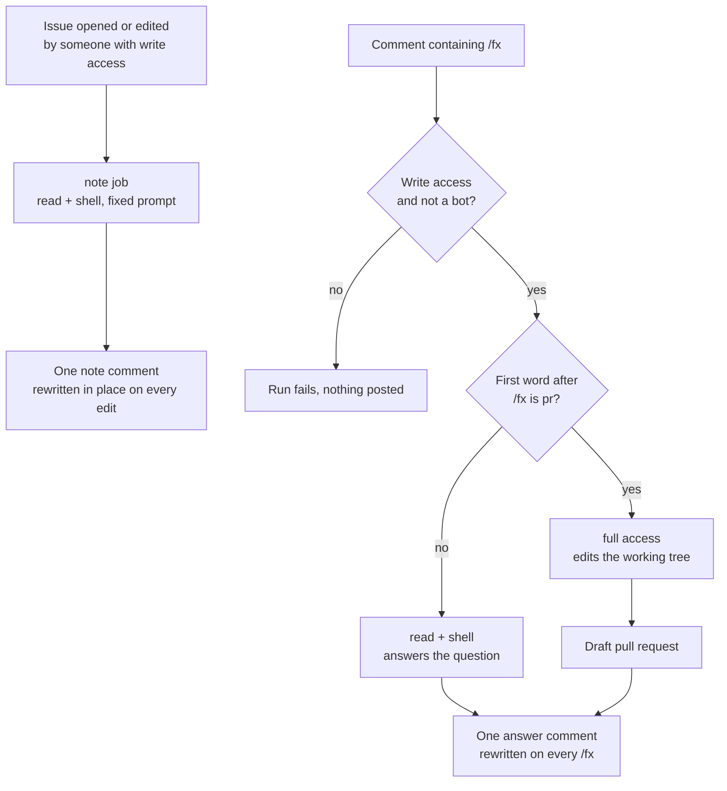

# fx agent action

[](https://github.com/khalido/fx-agent-action/actions/workflows/check.yml)

Comment `/fx` on a GitHub issue or pull request and [fx](https://fx.sh), Vercel
Labs' coding agent, answers after reading the code. `/fx pr …` gets a draft
pull request instead.

```yaml
# .github/workflows/fx.yml
name: fx
on:
  issue_comment:
    types: [created]
permissions:
  contents: read
  issues: write
  pull-requests: write
jobs:
  fx:
    if: contains(github.event.comment.body, '/fx') && github.event.comment.user.type != 'Bot'
    runs-on: ubuntu-latest
    timeout-minutes: 15
    steps:
      - uses: actions/checkout@v7
        with:
          persist-credentials: false
      - uses: khalido/fx-agent-action@v1
        env:
          AI_GATEWAY_API_KEY: ${{ secrets.AI_GATEWAY_API_KEY }}
```

```bash
vercel ai-gateway api-keys create --name github-actions --limit 10 --refresh-period monthly
gh secret set AI_GATEWAY_API_KEY
```

That is the setup. This one only answers. The file to copy into every repo is
[`examples/fx.yml`](examples/fx.yml): a note on every new issue, `/fx`
questions, and `/fx pr`. This repo runs it on itself. fx runs in your own
runner, no app to install, no service in the middle, and posts one comment
that it edits rather than a new one per run.

## What happens



Edit the issue and the note refreshes. Ask again and the answer refreshes.
Nothing merges without a person.

## Talking to it

**`/fx why is the sync running twice?`** reads the repo and the thread and
replies. It cannot edit files. By default it cannot run commands either;
`shell: true` adds them, for `git log` and the tests, and still commits nothing.

**`/fx pr add a retry to the API client`** edits the working tree, and what
changed becomes a branch and a draft PR linked from the comment. Needs
`contents: write`, branch protection on your default branch, and a setting
GitHub leaves off: Settings → Actions → General → "Allow GitHub Actions to
create and approve pull requests". From the CLI:

```bash
gh api -X PUT repos/OWNER/REPO/actions/permissions/workflow \
  -f default_workflow_permissions=read -F can_approve_pull_request_reviews=true
```

`/fx` can sit anywhere in the comment, any case, but not in a quoted line. The
request is what follows it. `pr` is the only word that turns writing on:
`do`, `build` and `fix` were on that list until "/fx do we already have a
retry helper?" handed a shell to a question.

A slash and not a mention because `@fx` is a real person on GitHub.
`trigger: '/fx, /agent'` accepts several phrases; widen the job's `if:` to
match.

## Changing what it says

Three layers. A repo touches the middle one.

1. **The base block**, written by the action: where it runs, which tools it
   has, that only the final answer is posted, no headers, files by path.
2. **The job's prompt**: `prompt` inline, or `prompt_file` in the repo. When
   both are set the file wins if it exists, so `examples/fx.yml` carries a
   default note prompt and a repo overrides it by adding
   `.github/fx/issue-notes.md`. [`prompts/issue-notes.md`](prompts/issue-notes.md)
   is that text. For `/fx` comments the prompt is the comment.
3. **The repo's own `AGENTS.md`**, which fx reads as it does on your machine.

## Who can trigger a run

Two checks before anything else, and the run fails if either says no. The same
two [claude-code-action](https://github.com/anthropics/claude-code-action) runs.

- **Write access.** On issue and PR events the actor must have write access to
  the repo. `allowed_non_write_users` names exceptions, or `*`, and only
  combines with `mode: read` and no shell. Scheduled runs skip this check.
- **Human actor.** A bot is rejected on every event unless it is in
  `allowed_bots`. That is what stops two bots looping.

Keep the `if:` on the job too. With `author_association` in it, as in
`examples/fx.yml`, a stranger's `/fx` never boots a runner.

## Inputs

All optional.

| Input | Default | |
|---|---|---|
| `prompt` | the comment | What to ask. The thread is appended below it. |
| `prompt_file` | | Instructions in a file in your repo. Wins over `prompt` when it exists. |
| `model` | `zai/glm-5.3-flash` | Any [AI Gateway model id](https://vercel.com/ai-gateway/models). |
| `mode` | `auto` | The comment decides. `read` and `write` force it. |
| `shell` | `false` | Shell in read mode too. Nothing is committed. |
| `trigger` | `/fx` | Whole word, anywhere in the comment. Comma-separate several. |
| `allowed_non_write_users` | | Logins exempt from the write check, or `*`. |
| `allowed_bots` | | Bots allowed to trigger, with or without `[bot]`, or `*`. |
| `max_steps` | `30` | Cap on the tool loop. |
| `max_cost` | `1` | Fail over this many dollars, after the fact. A `pr` still opens. |
| `post` | `comment` | `none` leaves the answer on the `response` output. |
| `comment_key` | | Keeps this job's comment apart from another fx job's. |
| `session_artifact` | `true` | The run as one HTML file on the run page. |
| `github_token` | the workflow's | An App token for a named bot. |
| `include_thread`, `include_diff` | `true` | What the agent sees besides title and body. |
| `issue_number`, `branch_prefix`, `working_directory` | | See [`action.yml`](action.yml). |

Outputs: `response`, `cost`, `steps`, `session_id`, `comment_url`, `pr_url`.

## Examples

Working workflows in [`examples/`](examples/):

- **[fx](examples/fx.yml)**: the one to copy. Issue notes, `/fx`, `/fx pr`.
- **[issue-notes](examples/issue-notes.yml)**: the note alone, from a prompt file.
- **[pr-review](examples/pr-review.yml)**: a review on open and on push, under 200 words, no praise.
- **[triage](examples/triage.yml)**: labels from the ones the repo has. The agent picks, the workflow applies, so it cannot invent one.
- **[build-it](examples/build-it.yml)**: `/fx pr` alone.
- **[weekly-deps](examples/weekly-deps.yml)**: bump, run your checks, one PR a week with a note.

[`docs/prior-art.md`](docs/prior-art.md) has more recipes and what the other
coding-agent actions do differently.

## When it goes wrong

Every run uploads the session as one HTML file, kept a week: every tool call,
its arguments, its result, including web searches with the exact date window
they used. Read that before guessing. The comment footer has the model,
tokens, cost in cents and a link to the run, and when a comment has been
rewritten it stacks the earlier runs and a total. The script does that sum,
not the model.

## A bot with its own name

Comments post as `github-actions[bot]`. For your own name, make a GitHub App,
install it, pass its token:

```yaml
- uses: actions/create-github-app-token@v3
  id: app
  with:
    app-id: ${{ secrets.FX_APP_ID }}
    private-key: ${{ secrets.FX_APP_PRIVATE_KEY }}
- uses: khalido/fx-agent-action@v1
  with:
    github_token: ${{ steps.app.outputs.token }}
```

Worth it for `pr`: GitHub runs no workflows on commits made with the default
token, so a PR opened without an App token gets no CI. The App is yours. I
don't want the ability to mint tokens into your repo.

## Before you turn it on

- **The thread goes to the model**, as evidence, with hidden markup stripped:
  HTML comments, zero-width characters, image alt text, hidden attributes.
  The comment that summons the agent is its instruction. That is why the
  write-access check exists.
- **The workflow's `permissions:` block decides what the agent can do**, not
  this action. `contents: write` can push to your default branch; branch
  protection is what makes "at most a draft PR" true.
- **Give the key its own budget.** The gateway enforces it. `max_cost` only
  notices afterwards. Anyone who can trigger a run can spend the key, and
  with `shell: true` a thread that talks the agent into a command has a shell
  that can read it. Secrets are scrubbed from everything posted; the budget
  is the control.
- **The agent reads the repo's `AGENTS.md`.** On a PR that is the PR's copy.
  The pr-review example skips forks for this reason.
- **Pinning the action does not pin fx.** fx ships weekly and the action
  installs the latest, on purpose. The comment footer says which version ran.
- **Web search needs no key.** It is on by default, billed to the same key.

## Do you need this?

For one repo, maybe not:

```yaml
- run: curl -fsSL https://fx.sh/setup.sh | bash
- run: fx ask --json "$PROMPT" | jq -r .final_output | gh issue comment "$N" --body-file -
```

[`examples/minimal-no-action.yml`](examples/minimal-no-action.yml) is that,
finished. The action adds what you would paste into every repo: the actor
checks, one comment instead of a pile, a cached binary, read-only that holds,
the thread and diff with hidden markup stripped, and the session to read when
it goes wrong.

## Prior art

[shaftoe/pi-coding-agent-action](https://github.com/shaftoe/pi-coding-agent-action)
gave this the comment marker and the 👀. [opencode](https://opencode.ai/docs/github/)
the cached binary. [claude-code-action](https://github.com/anthropics/claude-code-action)
the actor checks, the hidden-markup list, and stopping short of a merge: it
stops at a branch and a link, this goes one step further to a draft PR.
[`docs/prior-art.md`](docs/prior-art.md) is the full survey.

Working on this action itself? [`AGENTS.md`](AGENTS.md), and fx's docs at
[fx.sh/llms.txt](https://fx.sh/llms.txt) first.

Apache-2.0, the same license as fx.
