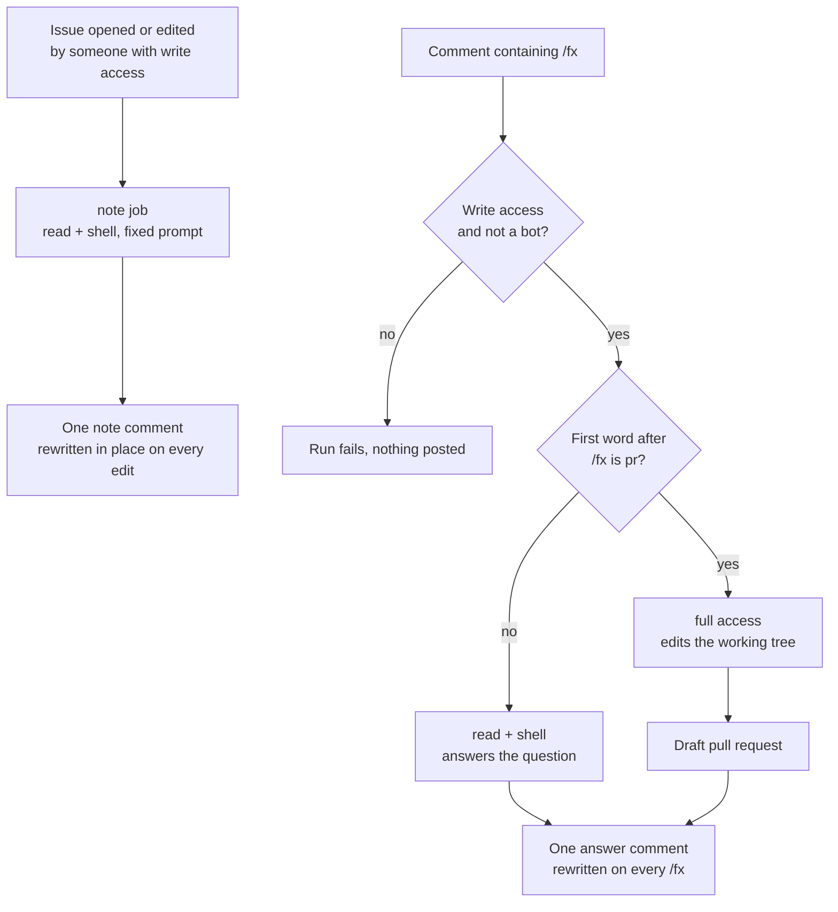

# fx agent action

[](https://github.com/khalido/fx-agent-action/actions/workflows/check.yml)

Comment `/fx` on a GitHub issue or pull request and get an answer from
[fx](https://fx.sh), Vercel Labs' coding agent, after it has read the code. Say
`/fx pr …` and get a draft pull request instead.

```yaml
# .github/workflows/fx.yml
name: fx
on:
  issue_comment:
    types: [created]
permissions:
  contents: read
  issues: write
  pull-requests: write
jobs:
  fx:
    if: contains(github.event.comment.body, '/fx') && github.event.comment.user.type != 'Bot'
    runs-on: ubuntu-latest
    timeout-minutes: 15
    steps:
      - uses: actions/checkout@v6
        with:
          persist-credentials: false
      - uses: khalido/fx-agent-action@v1
        env:
          AI_GATEWAY_API_KEY: ${{ secrets.AI_GATEWAY_API_KEY }}
```

```bash
vercel ai-gateway api-keys create --name github-actions --budget 20 --refresh-period monthly
gh secret set AI_GATEWAY_API_KEY
```

That is the whole setup, and this one is read-only: it answers. The file to
copy into every repo is [`examples/fx.yml`](examples/fx.yml): a note on every
new or edited issue, `/fx` questions, and `/fx pr …`, in one workflow. This
repo runs that same file on itself. fx runs in your own Actions
runner: no app to install, no service in the middle. One comment, edited in
place, not a new one every run.

## What happens

With [`examples/fx.yml`](examples/fx.yml) in place:



The note and the answers are two comments, each found by a hidden marker and
rewritten rather than stacked. Edit the issue and the note refreshes. Ask again
and the answer refreshes. Nothing merges without a person.

## Talking to it

**`/fx why is the sync running twice?`** reads the repo and the thread and
replies. By default it cannot edit a file or run a command: fx's permission
rules deny those tools, so the model never sees them. `shell: true` gives it
commands as well, for `git log` and the tests, with edits still denied and
nothing committed.

**`/fx pr add a retry to the API client`** gets the edit and shell
tools as well. What it changed becomes a branch and a **draft** pull request,
linked from the comment. This needs `contents: write`, branch protection on
your default branch, and one repo setting GitHub leaves off by default:
Settings → Actions → General → "Allow GitHub Actions to create and approve
pull requests". Without it the push succeeds and the PR step fails. From the
CLI:

```bash
gh api -X PUT repos/OWNER/REPO/actions/permissions/workflow \
  -f default_workflow_permissions=read -F can_approve_pull_request_reviews=true
```

The phrase can sit anywhere in the comment, any case, but not inside a quoted
line. The request is what follows it. `pr` is the only word that turns writing
on, and that is deliberate: `do`, `build` and `fix` were in that list until
"/fx do we already have a retry helper?" handed a full-access shell to a
question.

Why a slash and not a mention: `@fx` is a real person on GitHub, and every
mention in a public repo would page them. `@fx-agent` is unclaimed and works if
you prefer the look of a mention; so does any list of phrases,
`trigger: '/fx, /agent'`. Widen the job's `if:` to match.

## Changing what it says

Three layers, and a repo touches only the middle one:

1. **The base block**, written by the action: where it is running, which tools
   it has in this mode, that only its final answer is posted, no headers, name
   files by path. Fixed.
2. **The job's prompt**, on top: `prompt` inline in the workflow, or
   `prompt_file` pointing at a file in the repo. When both are set the file
   wins if it exists, so [`examples/fx.yml`](examples/fx.yml) carries a default
   note prompt and a repo overrides it by adding `.github/fx/issue-notes.md`.
   [`prompts/issue-notes.md`](prompts/issue-notes.md) is that text, ready to
   copy. For `/fx` comments the prompt is the comment.
3. **The repo's own `AGENTS.md`**, which fx reads as project guidance, the
   same as it does on your machine.

## Who can trigger a run

Two checks run before anything else, and the run fails if either says no. They
are the same two [claude-code-action](https://github.com/anthropics/claude-code-action)
runs.

- **Write access.** On issue and pull request events, the person who triggered
  the run must have write access to the repository. Anyone can comment on a
  public repo; that must not be enough to spend your key or direct an agent
  holding a token that can push. `allowed_non_write_users` names exceptions,
  or `*` for anyone, and only combines with `mode: read`. Scheduled runs
  skip this check; nobody authored them.
- **Human actor.** On every event, a bot is rejected unless it is in
  `allowed_bots`. That is what keeps two bots from triggering each other
  forever. Scheduled runs are attributed to whoever last edited the cron line,
  so if that was a bot, list it.

The `if:` on the job is still worth having, and `examples/fx.yml` filters on
`author_association` too: on a public repo a stranger's `/fx` then never boots
a runner, let alone bills a model call. But the `if:` is a filter. The check is
the action's.

## Inputs

Every one is optional.

| Input | Default | |
|---|---|---|
| `prompt` | the comment | What to ask. The thread is appended below it. |
| `prompt_file` | | A file in your repo holding the instructions instead, so you edit the agent without touching YAML. |
| `model` | `zai/glm-5.3-flash` | Any [AI Gateway model id](https://vercel.com/ai-gateway/models). |
| `mode` | `auto` | `auto` lets the comment decide. `read` and `write` force it. |
| `shell` | `false` | Shell in read mode too: `git log`, the tests. Nothing is committed. |
| `trigger` | `/fx` | The phrase. Whole word, anywhere in the comment. Comma-separate several. |
| `allowed_non_write_users` | | Logins exempt from the write-access check, or `*`. |
| `allowed_bots` | | Bots allowed to trigger a run, with or without `[bot]`, or `*`. |
| `max_steps` | `30` | Cap on the agent's tool loop. |
| `max_cost` | `1` | Fail over this many dollars, after the fact. |
| `post` | `comment` | `none` leaves the answer on the `response` output instead. |
| `comment_key` | | Keeps this job's comment apart from another fx job's on the same thread. |
| `session_artifact` | `true` | The whole run as one HTML file on the run page. |
| `github_token` | the workflow's | Pass an App token for a named bot. |
| `include_thread`, `include_diff` | `true` | What the agent is shown besides the title and body. |
| `issue_number`, `branch_prefix`, `working_directory` | | Rarely needed; see [`action.yml`](action.yml). |

Outputs: `response`, `cost`, `steps`, `session_id`, `comment_url`, `pr_url`.

## What to point it at

[`examples/`](examples/) holds working workflows, not sketches:

- **[fx](examples/fx.yml)**: the one to copy. A note on every issue from someone with write access, refreshed when the issue is edited, plus `/fx` and `/fx pr` on issues and PRs. Both have the shell; only `pr` commits. The note and the answers are separate comments.
- **[issue-notes](examples/issue-notes.yml)**: a second opinion on an issue from something that has read the code. Instructions live in your repo; start from [`prompts/issue-notes.md`](prompts/issue-notes.md).
- **[pr-review](examples/pr-review.yml)**: review on open and on push, under 200 words, no praise.
- **[triage](examples/triage.yml)**: labels from the ones your repo already has. The agent picks from a list and the workflow applies it, so it cannot invent one.
- **[build-it](examples/build-it.yml)**: `/fx pr …` opens a draft PR.
- **[weekly-deps](examples/weekly-deps.yml)**: bump, run your checks, one PR a week with a note. What dependabot should have been.

More recipes, and what the other coding-agent actions do differently, are in
[`docs/prior-art.md`](docs/prior-art.md).

## When it goes wrong

Every run uploads the session as one HTML file, kept on the run page for a
week: every tool call, its arguments and its result. Read that before guessing.
The comment footer has the model, the time, the cost and a link to the run.

## A bot with its own name

Comments post as `github-actions[bot]`. For your own name and avatar, make a
GitHub App, install it on the repo, and pass its token:

```yaml
- uses: actions/create-github-app-token@v2
  id: app
  with:
    app-id: ${{ secrets.FX_APP_ID }}
    private-key: ${{ secrets.FX_APP_PRIVATE_KEY }}
- uses: khalido/fx-agent-action@v1
  with:
    github_token: ${{ steps.app.outputs.token }}
```

Worth doing for `pr`: GitHub runs no workflows on commits made with the default
`GITHUB_TOKEN`, so a PR opened without an App token gets no CI. The App is
yours. There is no app to install from me and no service in the middle.

## Before you turn it on

- **The thread goes to the model.** The issue body and every comment are
  handed over as evidence. Hidden markup is stripped out first: HTML comments,
  zero-width characters, image alt text, hidden attributes. The comment that
  summons the agent is its instruction, which is why the write-access check
  exists. With `shell: true`, a thread that talks the agent into running a
  command has a shell that can read the key, so the budget on that key is the
  real ceiling.
- **What the agent may do to your repo is the workflow's `permissions:`
  block**, not anything in this action. `contents: write` lets a job push a
  branch and also your default branch. Branch protection is what makes "at
  most a draft PR" true.
- **Give the key its own budget.** The gateway enforces it and returns a 402.
  This action's `max_cost` only notices afterwards. Use a dedicated key, not
  the one you code with: anyone who can trigger a run can spend it. Secrets
  are scrubbed from the answer, the PR body and the session artifact, but the
  budget is the control and the scrubber is the backstop.
- **The agent reads the repo's own `AGENTS.md`**, as fx does everywhere. On a
  pull request that means the PR's version of it. The pr-review example skips
  forks for this reason; keep that line.
- **Pinning the action does not pin fx.** The binary is whatever fx released
  last, on purpose: it ships weekly and an agent pinned to an old release ages
  badly. The footer of every comment says which version ran.
- **Web search needs no extra key.** It is on by default and billed through
  the same gateway key.

## Do you need this?

For one repo, maybe not:

```yaml
- run: curl -fsSL https://fx.sh/setup.sh | bash
- run: fx ask --json "$PROMPT" | jq -r .final_output | gh issue comment "$N" --body-file -
```

[`examples/minimal-no-action.yml`](examples/minimal-no-action.yml) is that,
finished. The action adds what you would otherwise paste into every repo: the
actor checks, one comment instead of a pile, a cached binary, read-only that
holds, the thread and diff handed to the model with hidden markup stripped, and
the session to read when it goes wrong.

## For agents

Setting this up in a repo with a coding agent? Point it at this file and at
[`action.yml`](action.yml), which documents every input. Working on this action
itself? Read [`AGENTS.md`](AGENTS.md), and fx's own docs at
[fx.sh/llms.txt](https://fx.sh/llms.txt) before touching anything that calls fx.

## Prior art

[`docs/prior-art.md`](docs/prior-art.md) is the survey. The short version:
[shaftoe/pi-coding-agent-action](https://github.com/shaftoe/pi-coding-agent-action)
gave this the comment marker and the 👀; [opencode](https://opencode.ai/docs/github/)
the cached binary; [claude-code-action](https://github.com/anthropics/claude-code-action)
the actor checks, the hidden-markup list, and stopping short of a merge. It
stops at a branch and a link; this one goes one step further to a draft PR.

Apache-2.0, the same license as fx.
